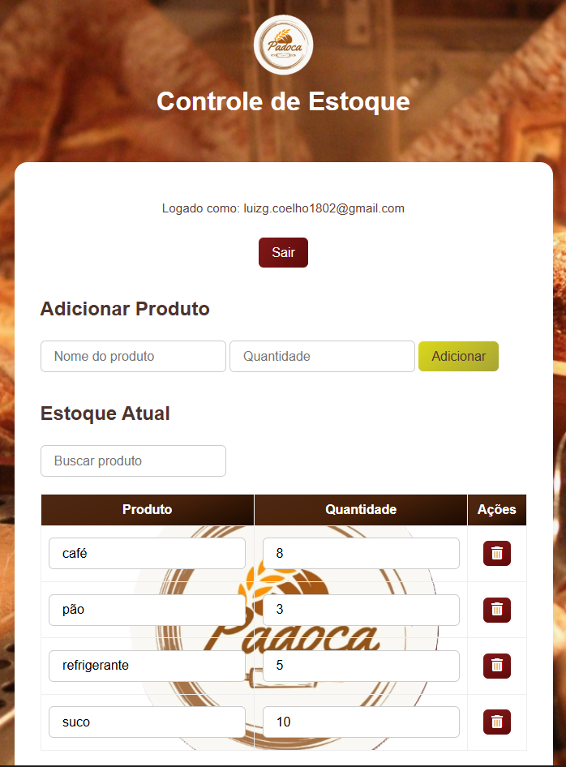

# 🥖 Sistema de Controle de Estoque – Padoca

Este é um sistema simples e eficiente de **controle de estoque**, desenvolvido originalmente para uma padaria chamada **Padoca**, mas adaptável para qualquer pequeno comércio, como mercearias, lanchonetes, cafeterias e até lojas de conveniência.

## 🚀 Funcionalidades

- Login com autenticação via Google
- Adição de produtos com nome e quantidade
- Edição direta da quantidade em estoque
- Busca de produtos por nome
- Exclusão de itens com um clique
- Interface limpa e intuitiva, com foco na praticidade

## 🖼️ Preview do Sistema



---

## 🛠️ Tecnologias Utilizadas

- **Frontend:** HTML, CSS, JavaScript
- **Backend:** Firebase (Autenticação e Firestore)
- **Hospedagem:** Firebase Hosting

---

## ⚙️ Como Usar

Este sistema pode ser utilizado diretamente através do GitHub Pages, sem necessidade de configuração local. Para isso, acesse:
https://luizgcoelho.github.io/Padoca-EstoqueHTML/

Se preferir, você também pode clonar o repositório e conectar com o seu próprio Firebase:

1. **Clone o repositório:**

   ```bash
   git clone https://github.com/seu-usuario/seu-repositorio.git
   cd seu-repositorio
   ```

2. **Configure seu projeto no Firebase:**

   - Crie um projeto no [Firebase Console](https://console.firebase.google.com/)
   - Ative a autenticação com Google
   - Ative o Firestore Database
   - Copie as credenciais para o arquivo `firebase-config.js`

3. **Edite o arquivo `firebase-config.js` com suas chaves:**

   ```js
   const firebaseConfig = {
     apiKey: "SUA_API_KEY",
     authDomain: "SEU_DOMINIO.firebaseapp.com",
     projectId: "SEU_PROJECT_ID",
     storageBucket: "SEU_BUCKET.appspot.com",
     messagingSenderId: "SEU_SENDER_ID",
     appId: "SEU_APP_ID"
   };
   ```

4. **Abra o arquivo `index.html` no navegador ou publique com Firebase Hosting.**

---

## 📦 Estrutura do Projeto

```
/
├── index.html
├── style.css
├── script.js
└── firebase-config.js
```

---

## 👤 Autor

Desenvolvido por Luiz Guilherme e Nathalia 
📧 [luizg.coelho1802@gmail.com](mailto:luizg.coelho1802@gmail.com)
📧 [nathaliamartinsandrade.anaile@gmail.com](mailto:nathaliamartinsandrade.anaile@gmail.com)

---

## 🌟 Contribuições

Contribuições são bem-vindas! Abra uma issue ou envie um pull request com melhorias, bugs ou sugestões.
